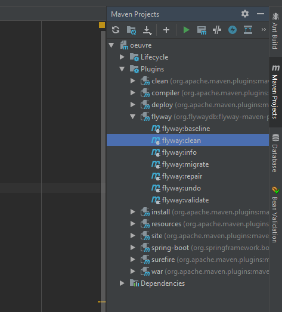

# Projet Oeuvres

# Plugins
## Gestion de la BDD
La base de données est gérée par le plugin **flyway**, celui-ci permet
de versionner les changements apportés à la BDD.

L'ajout/modification de tables dans la base se fait par la création
d'un nouveau fichier dans :
<pre>src/main/resources/db/migration</pre>

Les fichiers sont nommés de la manière suivante :  
<pre>V + [Version majeure] + [Version mineure] + [Version fix] + __ + [description rapide].sql</pre>
Par exemple : "V-0.0.0000__init_baseoeuvre.sql"

### Actions à effectuer sur la BDD
Si la base n'a pas déjà été initialisée, il faut (pour IntelliJ) se
rendre dans l'onglet vertical de droite nommé *Maven*, puis *Plugins*
et enfin dans *flyway* choisir *flyway:clean*.

Lors de l'ajout d'un fichier de modification de la base (une
migration), **flyway** s'occupe de migrer la base lors du prochain
démarrage du projet.

### Plus d'informations sur **flyway**
Plus d'informations sur le site : [flywaydb.org](https://flywaydb.org/getstarted)